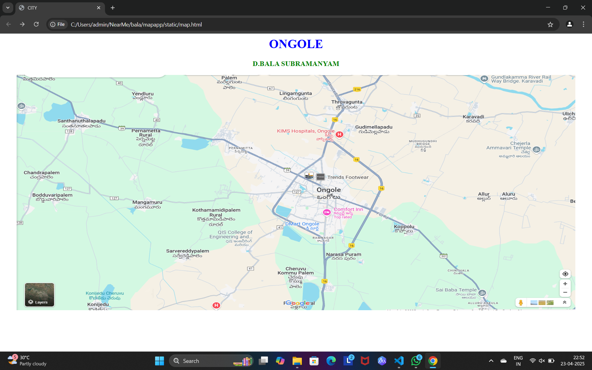
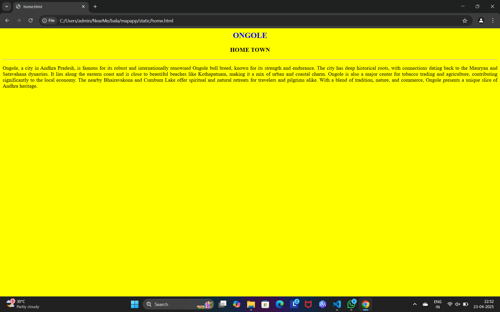
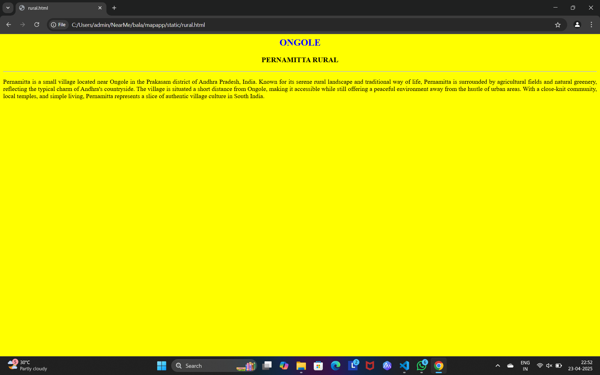
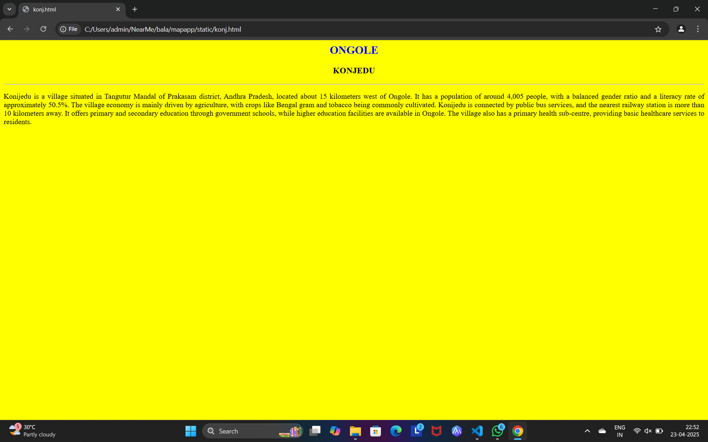
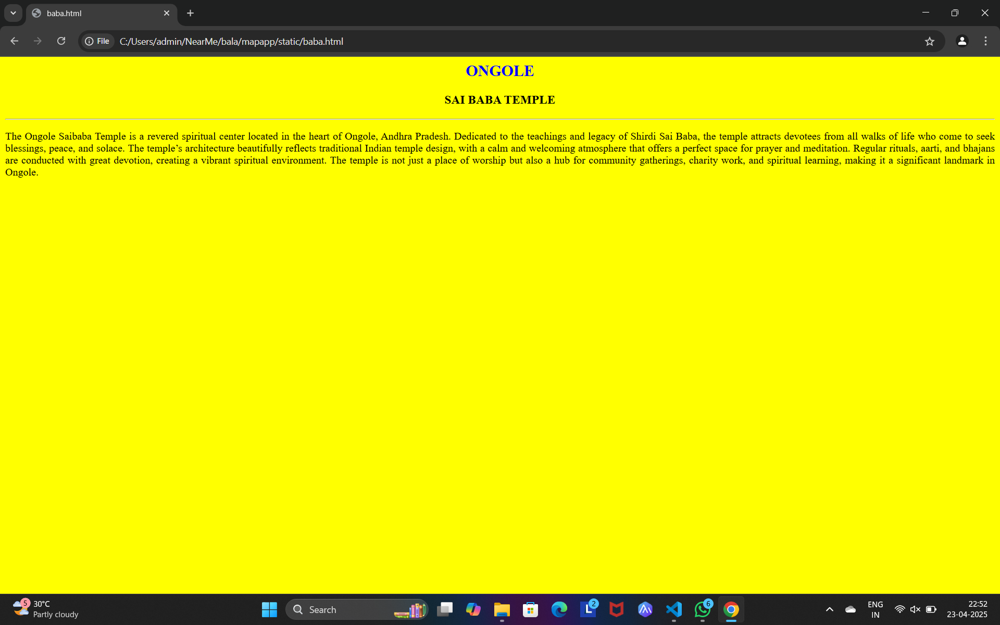
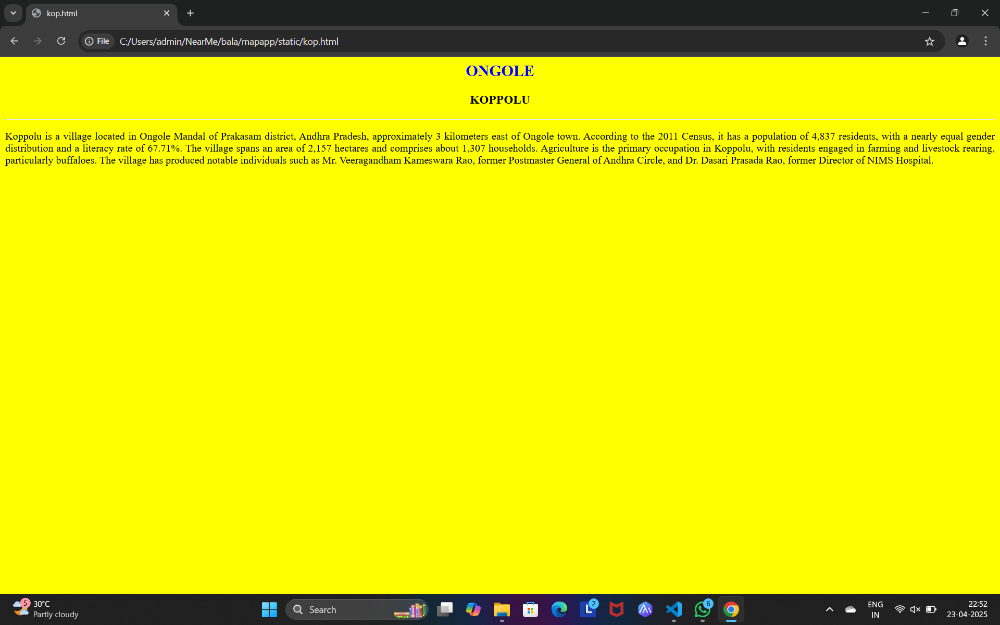

# Ex04 Places Around Me
## Date:23-04-2025 

## AIM
To develop a website to display details about the places around my house.

## DESIGN STEPS

### STEP 1
Create a Django admin interface.

### STEP 2
Download your city map from Google.

### STEP 3
Using ```<map>``` tag name the map.

### STEP 4
Create clickable regions in the image using ```<area>``` tag.

### STEP 5
Write HTML programs for all the regions identified.

### STEP 6
Execute the programs and publish them.

## CODE
```
map.html

<html>
    <head>
       <title>CITY</title>
    </head>
    <body>
        <h1 align="center">
            <font color="blue"><b>ONGOLE</b></font>
        </h1>
        <h3 align="center">
        <font color="green"><b>D.BALA SUBRAMANYAM</b></font>
        </h3>
        <CENTER>
            
            <map name="MyCity">
            <area shape="rect" coords="600,250,850,400" href="home.html" title="MY HOME TOWN">
            <area shape="rect" coords="200,100,500,500" href="rural.html" title="PERNAMITTA RURAL">
            <area shape="rect" coords="1033,330,1202,404" href="kop.html"  title="KOPPOLU">
            <area shape="rect" coords="1129,468,1356,615" href="baba.html" title="SAI BABA TEMPLE">
            <area shape="rect" coords="61,486,194,564" href="konj.html" title="KONIJEDU">
    
            </map>
        </CENTER>
    </body>
</html>

baba.html

<html>
    <BODY bgcolor="yellow">
    <h2 align="center"><font color="BLUE">ONGOLE</h2></FONT>
    <H3 align="center">SAI BABA TEMPLE</H3>
    <HR>
        <p align="justify">The Ongole Saibaba Temple is a revered spiritual center located in the heart of Ongole, Andhra Pradesh. Dedicated to the teachings and legacy of Shirdi Sai Baba, the temple attracts devotees from all walks of life who come to seek blessings, peace, and solace. The temple’s architecture beautifully reflects traditional Indian temple design, with a calm and welcoming atmosphere that offers a perfect space for prayer and meditation. Regular rituals, aarti, and bhajans are conducted with great devotion, creating a vibrant spiritual environment. The temple is not just a place of worship but also a hub for community gatherings, charity work, and spiritual learning, making it a significant landmark in Ongole.</p>
    </BODY>
    </html>

home.html

<html>
    <BODY bgcolor="yellow">
    <h2 align="center"><font color="BLUE">ONGOLE</h2></FONT>
    <H3 align="center">HOME TOWN</H3>
    <HR>
    <p align="justify">Ongole, a city in Andhra Pradesh, is famous for its robust and internationally renowned Ongole bull breed, known for its strength and endurance. The city has deep historical roots, with connections dating back to the Mauryan and Satavahana dynasties. It lies along the eastern coast and is close to beautiful beaches like Kothapatnam, making it a mix of urban and coastal charm. Ongole is also a major center for tobacco trading and agriculture, contributing significantly to the local economy. The nearby Bhairavakona and Cumbum Lake offer spiritual and natural retreats for travelers and pilgrims alike. With a blend of tradition, nature, and commerce, Ongole presents a unique slice of Andhra heritage.</p>
</BODY>
</html>

konj.html

<html>
    <BODY bgcolor="yellow">
    <h2 align="center"><font color="BLUE">ONGOLE</h2></FONT>
    <H3 align="center">KONJEDU</H3>
    <HR>
    <p align="justify">Konijedu is a village situated in Tangutur Mandal of Prakasam district, Andhra Pradesh, located about 15 kilometers west of Ongole. It has a population of around 4,005 people, with a balanced gender ratio and a literacy rate of approximately 50.5%. The village economy is mainly driven by agriculture, with crops like Bengal gram and tobacco being commonly cultivated. Konijedu is connected by public bus services, and the nearest railway station is more than 10 kilometers away. It offers primary and secondary education through government schools, while higher education facilities are available in Ongole. The village also has a primary health sub-centre, providing basic healthcare services to residents.</p>
</BODY>
</html>

kop.html

<html>
    <BODY bgcolor="yellow">
    <h2 align="center"><font color="BLUE">ONGOLE</h2></FONT>
    <H3 align="center">KOPPOLU</H3>
    <HR>
    <p align="justify">Koppolu is a village located in Ongole Mandal of Prakasam district, Andhra Pradesh, approximately 3 kilometers east of Ongole town. According to the 2011 Census, it has a population of 4,837 residents, with a nearly equal gender distribution and a literacy rate of 67.71%.  The village spans an area of 2,157 hectares and comprises about 1,307 households. 

        Agriculture is the primary occupation in Koppolu, with residents engaged in farming and livestock rearing, particularly buffaloes.  The village has produced notable individuals such as Mr. Veeragandham Kameswara Rao, former Postmaster General of Andhra Circle, and Dr. Dasari Prasada Rao, former Director of NIMS Hospital.</p>
</BODY>
</html>

rural.html

<html>
    <BODY bgcolor="yellow">
    <h2 align="center"><font color="BLUE">ONGOLE</h2></FONT>
    <H3 align="center">PERNAMITTA RURAL</H3>
    <HR>
    <p align="justify">Pernamitta is a small village located near Ongole in the Prakasam district of Andhra Pradesh, India. Known for its serene rural landscape and traditional way of life, Pernamitta is surrounded by agricultural fields and natural greenery, reflecting the typical charm of Andhra's countryside. The village is situated a short distance from Ongole, making it accessible while still offering a peaceful environment away from the hustle of urban areas. With a close-knit community, local temples, and simple living, Pernamitta represents a slice of authentic village culture in South India.</p>
</BODY>
</html>
```


## OUTPUT







## RESULT
The program for implementing image maps using HTML is executed successfully.
